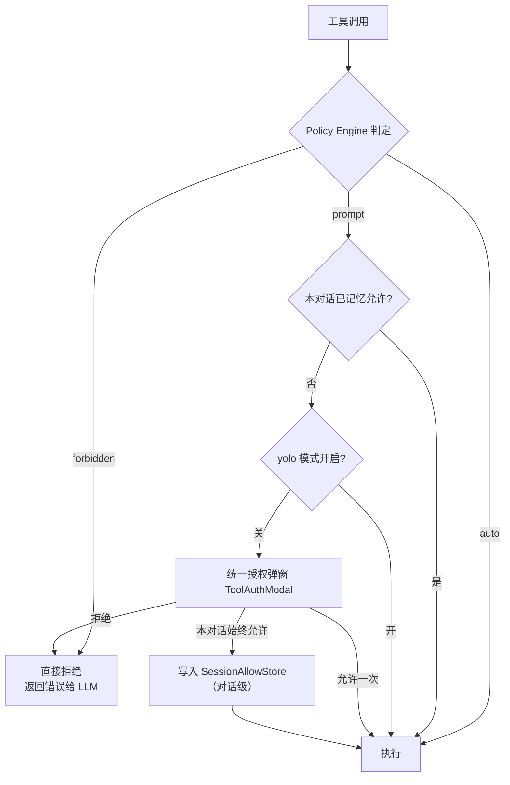
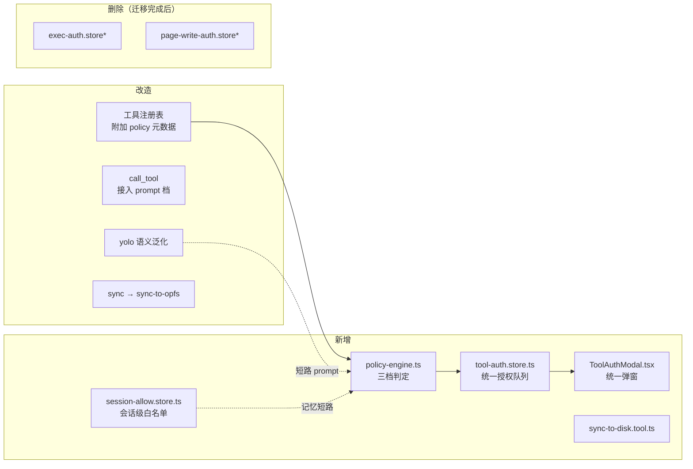

# 工具授权模式重设计（Tool Authorization Redesign）

- **状态**：Draft（待评审）
- **日期**：2026-08-29
- **范围**：web/agent、web/store、web/components/agent、web/opfs（工具入口层）
- **前置调查**：本文结论基于 2026-08-29 对 main 分支的代码勘查，关键文件路径见附录 A。

---

## 1. 背景与动机

### 1.1 问题

当前平台存在 **三套并行、互不相通的授权机制**：

| 机制 | 通道 | 覆盖范围 | 问题 |
|---|---|---|---|
| ① 对话流提问 | `ask_user_question` → QuestionCard | 任意提问 | 与工具执行耦合弱，智能体"绕路"提问 |
| ② 工具级授权模态 | `exec-auth.store`（FIFO）+ `page-write-auth.store`（单槽） | 仅 exec、page-action 写操作 | 两套同构 store 代码重复、语义不一致；均为一次性授权，无记忆 |
| ③ 变更 review 流 | OPFS pending changes + Sync 面板 + run 级 auto-apply | OPFS 文件写入 | 只覆盖 OPFS，不覆盖磁盘写入与外部调用 |

同时存在两个具体缺口：

1. **`call_tool`（MCP/WebMCP 外部工具调用）零授权**：执行路径上没有任何用户确认，且在 `TOOL_MODE_CLASSIFICATION` 中被标为 `read` —— **plan 模式下也能调用外部工具**。
2. **缺少 `sync-to-disk` 工具**：智能体无法主动把 pending changes 落盘，只能被动等 run 结束的 auto-apply 或用户手动点面板；而落盘到真实磁盘是有风险操作，需要授权管控。

### 1.2 目标

- 建立**统一的 Tool Policy Engine**：所有工具按 `auto / prompt / forbidden` 三档判定。
- **合并** ② 中的两个 auth store 为一个通用 `ToolAuthModal` 通道，支持"本会话始终允许"。
- **泛化 yolo 模式**：从"仅 page-action 跳过确认"升级为"跳过所有 prompt 档"的总开关。
- 给 `call_tool` 加上逐次授权（带 server/tool 级白名单记忆）。
- 新增 `sync-to-disk` 工具，并将现有 `sync` 更名为 `sync-to-opfs`。

### 1.3 非目标（Non-goals）

- 不改变 exec policy 的判定位置（仍在 Rust Native Host 侧解析 `execpolicy.json`）；web 侧 policy engine 只处理非 exec 工具，exec 的结果映射进统一框架。
- 不改变 OPFS pending changes 的 review 流（机制 ③ 保持不变，作为文件安全的第二道防线）。
- 不引入跨会话（重启浏览器后）的授权持久化——"始终允许"仅限当前会话。
- 不修改 MCP host/group 级"启用插件"授权（扩展侧管理，与本次逐调用授权正交）。

---

## 2. 设计总览

### 2.1 授权决策流



**四条不变式（安全底线）：**

1. `forbidden` **永不**被 yolo、会话记忆、任何配置跳过。
2. LLM **不能**自行开启 yolo（沿用现状：`switch_agent_mode` 切换时强制关闭 yolo；yolo 只能由用户在 UI 开启）。
3. 授权记忆与 yolo 状态均为**对话级作用域**（挂在 conversation 维度，纯内存不持久化）：切换/关闭对话即失效；刷新页面同样失效。详见 3.8 节作用域说明。
4. `sync-to-disk` 即使获得授权，执行时仍走既有冲突检测，**从不 force overwrite**；删除类变更不在该工具范围内。

### 2.2 模块划分



---

## 3. 详细设计

### 3.1 Tool Policy Schema

在工具注册元数据中附加 policy 字段（`web/agent/tools/` 各工具定义处 + 注册表 `web/agent/tool-registry.ts`）：

```ts
type ToolPolicy = {
  /** 默认决策档位 */
  level: 'auto' | 'prompt' | 'forbidden';
  /** 弹窗中展示给用户的说明（模板，支持 {{args.xxx}} 插值） */
  describe?: (args: unknown) => string;
  /** 会话记忆的 key 生成器；返回 null 表示不允许记忆（每次都必须问） */
  memoryKey?: (args: unknown) => string | null;
};
```

各工具的默认档位（**迁移后的全量分类表**）：

| 工具 | 档位 | 说明 |
|---|---|---|
| read / ls / search / glob 类 | auto | 只读 |
| run_python / bash(sandbox) | auto | OPFS 沙箱内 |
| write / edit / delete(OPFS) | auto | 有 pending review + 快照兜底 |
| sync-to-opfs | auto | 磁盘→OPFS，只进缓存不碰磁盘 |
| generate_image / 输出类 | auto | 资产沙箱 |
| **sync-to-disk** | **prompt** | 写真实磁盘；memoryKey 固定 `sync-to-disk`（可"始终允许"） |
| **call_tool** | **prompt** | memoryKey = `${server}::${tool}`（按 server+tool 记忆）；来自 untrusted 内容页的工具 memoryKey 返回 null，**每次必问** |
| **snapshot_restore** | **prompt** | 回滚影响面大 |
| exec（prompt 类命令） | prompt | 决策仍由 Native Host execpolicy 得出，结果映射进统一框架；force restore 删除类命令 |
| exec（forbidden 命令） | forbidden | 不变 |
| page-action 写操作 | prompt | 迁移自 page-write-auth；黑名单仍为硬 forbidden |
| switch_agent_mode 提权（plan→act） | forbidden | LLM 不得自我提权（沿现状） |

> exec 的特殊性：其 policy 判定在 Native Host 侧（`execpolicy.json`），web 侧拿到的已是三档结果。统一框架对 exec 只做"结果承接"——`auto` 直接执行、`prompt` 进统一弹窗、`forbidden` 拒绝——不再重复判定。

### 3.2 Policy Engine（`web/agent/policy-engine.ts`）

```ts
async function authorize(toolName: string, args: unknown, signal?: AbortSignal): Promise<AuthResult>;
// AuthResult = { decision: 'allow' } | { decision: 'deny', reason: string }
```

判定顺序（短路，从上到下）：

1. `level === 'forbidden'` → deny（附原因，让 LLM 能理解并改道）。
2. 会话白名单命中（`session-allow.store.has(memoryKey(args))`）→ allow。
3. yolo 开启且工具不在 `YOLO_EXEMPT` 集合（见 3.5）→ allow。
4. `level === 'auto'` → allow。
5. 进入统一授权弹窗，await Promise（带 AbortSignal、stale-approval 防护，沿用 exec-auth 已验证的实现）。

### 3.3 统一授权通道（合并两个 auth store）

- **`web/store/tool-auth.store.ts`**：一个 zustand FIFO 队列（合并 exec-auth 的 FIFO 与 page-write-auth 的单槽语义，统一为 FIFO）。每个请求含 `{ toolName, description, requestKey }`。
- **`web/components/agent/ToolAuthModal.tsx`**：替换 `ExecAuthModal` 与 `PageWriteAuthModal`。UI 要素：
  - 工具名 + `describe(args)` 渲染的上下文（如：`将把 3 个文件的改动写入磁盘目录 ~/my-project`）
  - 三个按钮：**允许一次** / **本对话始终允许**（仅当 `memoryKey` 非 null 时显示）/ **拒绝**
  - **交互约束（强制）**：点击遮罩层（backdrop）**不得**触发拒绝或关闭弹窗；仅允许通过三个显式按钮响应。同时禁用 `Esc` 关闭。理由：授权弹窗常在用户暂时离开（如 exec 长命令后台执行）时弹出，误触遮罩导致的隐式 deny 会让 LLM 拿到误导性的拒绝信号、中断正常流程，且用户毫无感知。弹窗必须保持阻塞直到用户显式点击
  - 拒绝时 reason 回传给 LLM，LLM 可据此调整行为
- **`web/store/session-allow.store.ts`**：`Map<conversationId, Set<string>>`，纯内存，**对话级作用域**（见 3.8）。提供 `has(convId, key) / add(convId, key) / clearFor(convId) / clearAll`；`clearFor` 在对话关闭时自动调用，`clearAll` 暴露在设置面板（"清除授权记忆"按钮）。
- **迁移策略**：`exec-auth.store` 与 `page-write-auth.store` 先保留为薄封装（内部转发到 tool-auth.store），待 page-action 一侧验证稳定后删除，避免一次性大爆炸。

### 3.4 call_tool 接入

- 位置：`web/agent/external-tool-bridge.ts` 的 `call_tool` 执行路径（约 L768-980），在真正 dispatch 前插入 `authorize('call_tool', { server, tool, args })`。
- **重分类**：`TOOL_MODE_CLASSIFICATION` 中 `call_tool` 从 `'read'` 改为新档 `'external'`；plan 模式下禁止（或降级为仅允许 `prompt` 且用户批准后单次执行——推荐后者，保持 plan 模式"只读探查外部信息"的可用性）。
- 白名单记忆粒度：`server::tool`。首次调用某工具必弹窗，勾选"始终允许"后该 server+tool 本会话免弹。
- `annotations.untrustedContent`（untrusted 提示包裹）保持不变；此类工具的 `memoryKey` 返回 null，强制逐次确认。
- search_tools（发现工具）保持 `read`，不加授权。

### 3.5 Yolo 模式泛化

- 现状澄清：代码中 `pageActionYolo` 实为**全局内存态**（`page-action-session.store.ts`，无持久化、无对话绑定，仅刷新重置）——历史上"仅刷新失效"。本设计将其**修正为对话级**，与授权记忆作用域对齐（见 3.8）。
- 改造：
  - 引入通用 `yoloMode`（替换/包裹 `pageActionYolo`），**对话级作用域**（见 3.8），保持纯内存不持久化。
  - 语义：**yolo = 跳过所有 prompt 档弹窗**（决策流第 3 步短路），对 `forbidden` 无效。
  - `YOLO_EXEMPT` 集合（yolo 也不放行的工具）：默认仅含"LLM 自我提权"类（plan→act 切换），初始为空集也成立，预留扩展点。
  - 保留现有安全阀：`switch_agent_mode` 切换时强制关闭 yolo；UI（`AgentModeSelect.tsx`）保持 plan / act / yolo 三态，yolo 的描述文案改为"自动批准所有需确认的操作（外部调用、磁盘写入等）"。

### 3.6 工具改名与 sync-to-disk

**改名**：`sync` → `sync-to-opfs`。

- 实现：`web/agent/tools/sync-opfs.tool.ts` 中工具 `name` 字段更名，保留 `aliases: ['sync']` 一个兼容周期（如注册表支持 alias 机制；不支持则仅在文档/系统提示中过渡说明）。
- 同步更新：系统提示词、skills 文档、DESIGN/用户指南中所有 `sync` 工具引用（全局搜索 `"sync"` 工具名）。

**新增 `sync-to-disk`**（`web/agent/tools/sync-to-disk.tool.ts`）：

- 入参：`{ paths?: string[] }`（与 sync-to-opfs 对称；缺省 = 全部 pending paths）。
- 实现：复用 `WorkspaceRuntime.syncToDisk(directoryHandle, onlyPaths, forceOverwrite=false)`——**工具层强制 `forceOverwrite: false`，不暴露该参数给 LLM**。
- 范围限制：**仅允许 create/modify**；若 `paths` 中包含删除类 pending change，将这些路径剔除并在结果中说明"删除类变更需用户在 Sync 面板手动确认"。
- 授权：policy `prompt`，`describe` 渲染待写文件数与目标 root 名；`memoryKey` 固定为 `sync-to-disk`。
- 与 run 级 auto-apply 的关系：`auto-apply-run-changes.ts` 保持现状（它有自己的保守策略与开关），本工具是**智能体主动触发**的补充路径，两者不互斥。
- **移除 exec flush 隐式落盘，改为结果提示（原 flush 存在授权旁路，决定移除而非收编）**：`exec.tool.ts` 的 `flushPendingForRoot`（约 L610-697）在 bash 执行前静默落盘，不经授权且不剔除 delete 类（会真删磁盘文件），LLM 可借 bash 绕过授权。PR-3 中**删除该逻辑**，改为：exec（native-host root 命令）执行后若该 root 存在 pending changes，在返回结果中附加提示：
  - 列出未同步文件及类型（文件多时截断），说明"命令在磁盘上看到的是旧版本"；
  - 指引 LLM：若命令结果依赖最新内容，先调用 `sync-to-disk`（走完整授权链）；
  - **delete 类单独点名**（磁盘上残留已删文件，bash 可能操作幽灵文件）；
  - 起步实现：只要该 root 有 pending 就附加提示，不做复杂相关性判断。
  - 效果：落盘收敛到 sync-to-disk 单一授权入口；隐式落盘仅剩 run 级 auto-apply（有保守策略与开关）；同步问题对 LLM 可诊断（因果链入上下文）。
- native-host root 场景：经 `executor-composite` 路由到 `NativeHostExecutor`，无需额外处理；若两类 handle 均不可用，返回可读错误引导用户完成目录授权（复用 `directory-handle-manager.requestDirectoryAccess`）。

### 3.7 与机制③（pending review 流）的关系

两层防线独立并存：

- 第一层：本设计的**调用时授权**（弹窗）——控制"智能体能否发起落盘"。
- 第二层：既有**冲突检测**（基线比对、不 force overwrite）——控制"落盘内容是否覆盖用户本地未保存修改"。
- OPFS 内写入（write/edit 等 auto 档）不受影响，仍靠 pending changes + 快照兜底。

---

### 3.8 作用域模型（Scope Model）

授权体系中三个状态的生效范围统一如下：

| 状态 | 作用域 | 失效时机 |
|---|---|---|
| yolo 开关 | **对话级** | 切换对话 / 关闭对话 / 刷新页面 |
| 授权记忆（"始终允许"） | **对话级**（`Map<convId, Set<memoryKey>>`） | 同上；对话关闭时 `clearFor(convId)` 自动清理 |
| 对话模式（plan/act） | 对话级（现状不变） | — |

设计理由：

- **统一为对话级**的原因：授权的心理模型是"我认可这段任务里的操作"——sync-to-disk 的目标目录、MCP 工具的使用场景都绑定在具体对话上；跨对话共享授权会让用户在 B 对话中遗忘 A 对话的放行，产生静默风险面。
- **对现状的行为修正**：yolo 从"全局内存态（仅刷新失效）"改为对话级，切换对话后需重新开启。这是有意的收紧，PR-4 中实施，并在 UI 上明确提示（切对话后 yolo 指示灯熄灭）。
- **不持久化**的原因：每次新会话都是重新审阅的机会，避免"半年前放过行、半年后智能体静默写磁盘"。
- 若未来需要跨对话/持久授权，应作为显式的 workspace 级偏好设置（带设置面板入口），而非隐式记忆——不在本期范围内。

---

## 4. 实施计划

分四个 PR，按依赖排序：

### PR-1：基础设施（无行为变化）
- 新增 `policy-engine.ts`、`tool-auth.store.ts`、`ToolAuthModal.tsx`、`session-allow.store.ts`
- `exec-auth.store` / `page-write-auth.store` 改为转发到新通道（行为等价，弹窗换成统一 Modal）
- 工具注册表附加 `policy` 元数据（全部按现状映射，不改变任何工具的实际行为）
- **验收**：现有 exec / page-action 授权流程不变，仅弹窗 UI 统一

### PR-2：call_tool 授权
- `call_tool` 重分类为 `external`，接入 `authorize()`，白名单记忆 `server::tool`
- untrusted 工具强制逐次确认
- plan 模式下 call_tool 需批准后单次执行
- 设置面板加"清除本会话授权记忆"
- **验收**：首次调用任一 MCP 工具弹窗；plan 模式可调用但需批准

### PR-3：sync 改名 + sync-to-disk
- `sync` → `sync-to-opfs`（含 alias 兼容、文档更新）
- 新增 `sync-to-disk.tool.ts`（prompt 档、forceOverwrite 锁死 false、剔除删除类）
- **移除 exec flush 隐式落盘**（`exec.tool.ts` `flushPendingForRoot`），改为执行后附加"存在未同步文件"提示（详见 3.6 节）
- **验收**：智能体可主动落盘且必弹窗；冲突路径正常回退；删除类被剔除并提示

### PR-4：yolo 泛化
- `pageActionYolo` → 通用 `yoloMode`，接入 policy-engine 决策流第 3 步
- `AgentModeSelect` 文案更新；`switch_agent_mode` 强关逻辑保持
- **验收**：yolo 开启时 sync-to-disk / call_tool / page-action 写操作全部免弹；forbidden 仍拒绝；LLM 切模式后 yolo 自动关闭

预估改动量：PR-1 最大（~8 文件），PR-2/3 各 ~4 文件，PR-4 ~3 文件。

---

## 5. 风险与缓解

| 风险 | 缓解 |
|---|---|
| 用户对 call_tool 弹窗疲劳，无脑点"始终允许" | 记忆粒度为 `server::tool` 且仅会话级；untrusted 工具永不记忆；设置面板一键清除 |
| yolo 泛化后被用户长期挂着，形同裸奔 | 状态栏常驻 yolo 指示（沿现有三态显示）；刷新即失效；LLM 切模式强制关闭 |
| sync-to-disk 覆盖用户本地未保存修改 | 双保险：授权弹窗（第一层）+ 冲突检测不 force overwrite（第二层），互相独立 |
| 改名破坏现有 skills/提示词中的 `sync` 引用 | alias 兼容一个周期；全局搜索清点引用（附录 B） |
| FIFO 队列合并后 page-action 单槽语义变化 | 单槽→FIFO 只会"排队"而不会"丢失"请求，语义更安全；PR-1 中重点回归 page-action 流程 |

---

### 3.9 代码勘查补充约束（2026-08-29 深入分析结论）

以下为实施时必须满足的硬约束，均已在代码中逐点验证：

1. **conversationId 获取**：`ToolContext.workspaceId` 即 conversationId（`conversation.store.sqlite.ts:4075/2382/2388` 三处注入）；为 null（subagent 边缘路径）时 session-allow 记忆**不命中且不可写入**（每次必问），不做全局 fallback。
2. **call_tool 线程上下文**：MCP（浏览器内 transport）与 WebMCP（扩展 postMessage）均主线程执行，zustand 弹窗可用——已排除 Worker 风险。
3. **page-action URL 黑名单必须前置**：作为 policy-engine 决策序之前的独立 pre-check（不可记忆、不可 yolo 短路），不并入 forbidden 档。
4. **stale-approval 双层防护必须完整迁移**：store 层 abort→resolve(false) + executor 层 `context.abortSignal?.aborted` 复查，缺一不可。
5. **registry 无 alias 机制**：PR-3 需显式新增（`aliases` 字段 + 注册表别名转发），同步改 `TOOL_MODE_CLASSIFICATION`、`ALL_PROMPT_DOCS`、6 处 `toolErrorJson('sync',…)` 字符串。
6. **plan 重分类双门控联动**：`tool-registry.getToolDefinitionsForMode`（提示词可见性）与 `build-agent-tools.ts:65`（运行时 throw）必须同 PR 修改；plan 下 call_tool 弹窗不提供"始终允许"按钮。
7. **resolve 签名扩展**：`resolve(approved, remember)` 双参；旧 store 转发封装同步改，否则"始终允许"静默降级。
8. **pending 类型 API 已存在**：`PendingChange.type`（`opfs-types.ts:85`）+ `getPendingChanges()`；剔除必须在传 `onlyPaths` 前完成，抽共享 helper（`auto-apply-run-changes.ts:67-72` 同源）。
9. **冲突为逐文件跳过**（`workspace-pending.ts:360-380`），非整批回退；`pendingManager.sync` 幂等，与手动面板并发落盘安全。

---

## 附录 A：关键文件索引

| 模块 | 路径 |
|---|---|
| exec 授权队列 | `web/agent/tools/exec-auth.store.ts`、`web/components/agent/ExecAuthModal.tsx` |
| page-action 授权 | `web/agent/tools/page-action-auth.ts`、`web/store/page-write-auth.store.ts`、`web/components/agent/PageWriteAuthModal.tsx` |
| exec policy | `web/agent/tools/exec.tool.ts`、`web/store/exec-policy.store.ts`、`web/components/settings/ExecPolicyPanel.tsx`（判定在 native host 侧 `execpolicy.json`） |
| 外部工具桥 | `web/agent/external-tool-bridge.ts` |
| 工具分类 | `web/agent/agent-mode.ts` (`TOOL_MODE_CLASSIFICATION`) |
| yolo 现状 | `web/store/page-action-session.store.ts`、`web/components/agent/AgentModeSelect.tsx`、`web/agent/tools/switch-mode.tool.ts` |
| 落盘链路 | `web/opfs/workspace/workspace-runtime.ts` (`syncToDisk`)、`web/opfs/workspace/workspace-pending.ts`、`web/opfs/native-disk/executor-{fsaccess,native-host,composite}.ts` |
| run 级自动应用 | `web/agent/auto-apply-run-changes.ts`、`web/store/conversation.store.sqlite.ts`（挂接点） |
| sync 工具（待改名） | `web/agent/tools/sync-opfs.tool.ts` |

## 附录 B：改名清点项（PR-3 执行时全局搜索确认）

- `web/agent/tools/sync-opfs.tool.ts` 的工具 name/description
- 系统提示词中的工具说明（agent 构建处）
- 各 skill 文档（`.skills/`、skill-store、docs/）
- `DESIGN.md`、`USER_GUIDE.md`、`DEVELOPER_GUIDE.md` 中的工具引用
- 测试用例中的工具名断言
